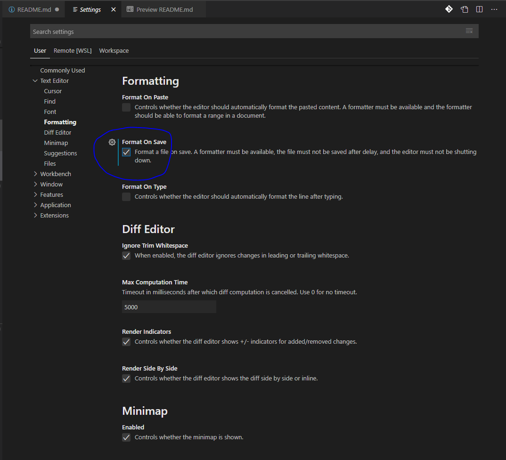

## Prettier with vscode (https://github.com/prettier/prettier-vscode)

1. Install
    > Install through VS Code extensions. Search for Prettier - Code formatter
2. Setting Default Formatter
   ```json
   {
        "editor.defaultFormatter": "esbenp.prettier-vscode",
        "[javascript]": {
            "editor.defaultFormatter": "esbenp.prettier-vscode"
        }
    }
   ```
3. Usage
   1. Using Command Palette (CMD/CTRL + Shift + P)
        > CMD + Shift + P -> Format Document  
        > OR   
        > Select the text you want to Prettify  
        > CMD + Shift + P -> Format Selection  
   2. Keyboard Shortcuts
        > shift + alt + f
   3. Format On Save
        ```json
        {
            // Set the default
            "editor.formatOnSave": false,
            // Enable per-language
            "[javascript]": {
                "editor.formatOnSave": true
            }
        }
        ````
        OR

        
   4. 
    >  
4. 
5. 